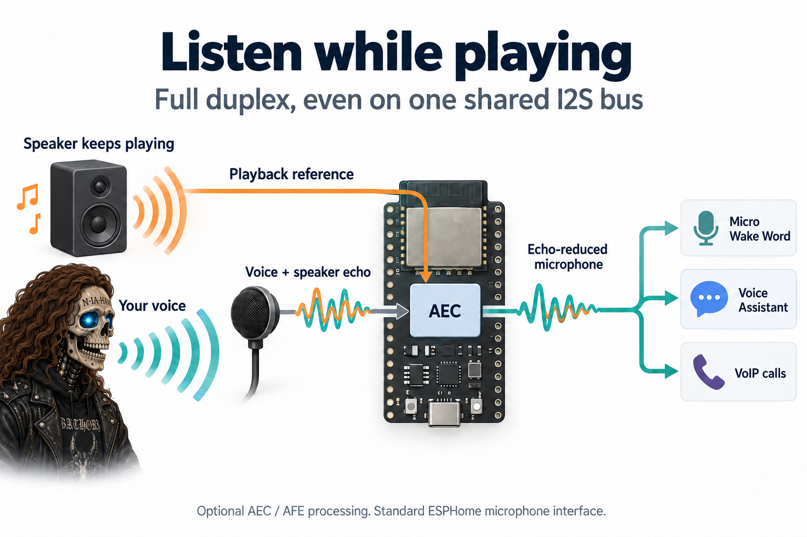

# ESPHome Audio Stack

**Capture the microphone and play the speaker at the same time, even on a
single shared I2S bus. Feed echo-cancelled microphone audio to Micro Wake Word,
Voice Assistant and calls through their normal ESPHome interfaces.**

Audio Stack coordinates the I2S input/output and supported hardware codecs.
It supports a single shared bus, separate RX/TX buses, and supported TDM
microphone layouts. A second I2S bus is **not required**.

With `esp_aec` or `esp_afe` enabled, the processor reduces the local speaker's
echo in the microphone signal **before** that signal reaches its consumers.
For example, while the device plays music or a spoken reply:

- **Micro Wake Word** receives processed microphone audio, helping it detect
  your wake word while playback continues.
- **Voice Assistant** receives that same processed input for speech-to-text,
  reducing the device's own playback in what it sends for recognition.
- **A VoIP call** sends processed microphone audio to the other party, reducing
  the echo of their voice returning through your speaker and microphone.



AEC reduces echo in **microphone capture while the speaker keeps playing**. Correct reference routing, levels and
microphone/speaker placement still matter; cancellation and wake-word detection
must be checked on the finished device.

The standard ESPHome microphone delivers the processed signal directly to its
consumers. Audio Stack works with ESPHome's
speaker, mixer, resampler and player components. Your runtime configuration
still decides which consumers run together and when Assist may start a session.
For devices that need only capture/playback, omit the optional processor.

[Stable 2026.10.0](https://github.com/n-IA-hane/esphome-audio-stack/releases/tag/v2026.10.0)
| [Changelog](CHANGELOG.md)

This guide describes Audio Stack 2026.10.0. Use ESPHome **2026.9.0 or newer**,
ESP-IDF, and an ESP32-S3 or ESP32-P4 with PSRAM. Select the correct PSRAM mode and
pins from your board's schematic.

Read in order for a first build, or jump to the relevant hardware:

1. [Start with a microphone and speaker](#1-start-with-a-microphone-and-speaker)
2. [One bus or two](#2-one-bus-or-two)
3. [Add a hardware codec](#3-add-a-hardware-codec)
4. [Add echo cancellation](#4-add-echo-cancellation)
5. [Use the codec stereo channel as a reference](#5-use-the-codec-stereo-channel-as-a-reference)
6. [Use TDM for multiple input channels](#6-use-tdm-for-multiple-input-channels)
7. [Add AFE speech processing](#7-add-afe-speech-processing)
8. [Combine different rates and playback sources](#8-combine-different-rates-and-playback-sources)
9. [Tune and diagnose the finished device](#9-tune-and-diagnose-the-finished-device)

## 1. Start with a microphone and speaker

Start with Audio Stack alone; add processing and application components as needed.
For example, an I2S MEMS microphone and an I2S amplifier can share clock wires
while using separate data wires:

```text
                              +--> Microphone BCLK / WS
ESP BCLK / WS ----------------+
                              +--> Amplifier BCLK / WS

Microphone DATA -------------> ESP DIN  --> microphone consumers
Amplifier DATA <-------------- ESP DOUT <-- speaker PCM
```

BCLK clocks individual bits. WS (also called LRCLK) identifies the audio frame
and its left/right slots. DIN and DOUT are named from the ESP's point of view.
The microphone and amplifier must accept the same clock rate and frame format.
This arrangement works directly with compatible I2S microphone and amplifier modules.

The [complete generic example](examples/00-generic-i2s-duplex.yaml) supplies the
ESPHome board, PSRAM and component declarations. Its audio section is:

```yaml
esp_audio_stack:
  id: audio_stack
  sample_rate: 16000
  bits_per_sample: 32
  slot_bit_width: 32
  rx_slot_mode: stereo
  mic_channel: left
  i2s_bclk_pin: GPIO6
  i2s_lrclk_pin: GPIO7
  i2s_din_pin: GPIO4
  i2s_dout_pin: GPIO8

microphone:
  - platform: esp_audio_stack
    id: board_mic
    esp_audio_stack_id: audio_stack

speaker:
  - platform: esp_audio_stack
    id: board_speaker
    esp_audio_stack_id: audio_stack
```

These are example GPIOs for an S3 prototype, not universal board pins. Set the
microphone's L/R selection to match `mic_channel`, and configure the amplifier's
channel selection according to its datasheet. This is standard I2S, not PDM.

The microphone exposes mono signed 16-bit PCM, even when the physical bus uses
32-bit slots. The speaker also accepts signed 16-bit PCM at the bus rate. A
consumer such as Voice Assistant starts capture; a playback component writes
speaker samples. Add a recording, playback or calling component to use these
audio endpoints.

Without `processor_id`, capture contains the microphone signal with the
configured conversion and gain, including any sound from the local speaker.
For microphone-only or speaker-only hardware, declare only the public platform
you use and omit the unused data pin. Internal clock generation may still be
needed even in a microphone-only configuration.

## 2. One bus or two

Both supported chips can capture and play simultaneously on **one shared I2S
bus**. Two separate buses are an optional wiring arrangement.

| Chip | Duplex on one shared bus | Two separate buses (optional) | TDM on one shared bus |
| --- | --- | --- | --- |
| ESP32-S3 | Yes | Yes | Yes |
| ESP32-P4 | Yes | Yes | Yes |

The ordinary shared-bus configuration uses one I2S peripheral.

**One shared bus** saves an I2S peripheral and clock pins. Audio Stack owns both
RX and TX, so they are configured together. Do not also assign those pins or
that peripheral to a native `i2s_audio` component.

**Two buses** suit boards where the microphone and amplifier use separate clock
wires. Replace the top-level I2S pin fields in the first example with:

```yaml
esp_audio_stack:
  id: audio_stack
  sample_rate: 16000
  bits_per_sample: 32
  slot_bit_width: 32
  rx_slot_mode: stereo
  mic_channel: left
  rx_bus:
    i2s_num: 0
    i2s_bclk_pin: GPIO6
    i2s_lrclk_pin: GPIO7
    i2s_din_pin: GPIO4
  tx_bus:
    i2s_num: 1
    i2s_bclk_pin: GPIO9
    i2s_lrclk_pin: GPIO10
    i2s_dout_pin: GPIO8
```

Both bus blocks are required and their port numbers must differ. This backend
uses the same configured sample rate for both. Split-bus mode supports standard
I2S; TDM uses the shared-bus configuration. The current schema
allows two I2S ports on S3 and three on P4.

If native ESPHome audio already supports your independent devices and you do
not need this backend's shared codec or reference handling, it remains a valid
choice. A device with hardware echo cancellation, such as an XMOS voice front
end, may not need a software processor here at all.

## 3. Add a hardware codec

A hardware codec converts analog microphone signals to digital samples (ADC)
and digital playback to analog output (DAC). This is different from an audio
file codec such as MP3 or FLAC. Audio Stack handles PCM and hardware codec
control; a media player/decoder handles compressed files.

The I2C connection configures the codec. I2S carries audio. Some codecs also
require MCLK, a higher-frequency master clock:

```text
ESP I2C SDA/SCL <-------------> Codec registers (gain, format, volume)
ESP MCLK/BCLK/WS -------------> Codec clocks
ESP DIN <--------------------- Codec ADC <--- microphone
ESP DOUT --------------------> Codec DAC ---> amplifier ---> speaker
```

Use the [ES8311 audio-only example](examples/01-esp-audio-stack-only.yaml) for
the declaration structure. Replace its GPIOs, I2C address and clock settings
with those of your board. The codec block is added to `esp_audio_stack`:

```yaml
codec:
  input:
    type: es8311
    address: 0x18
  output:
    type: es8311
    address: 0x18
```

The driver, through Espressif `esp_codec_dev`, owns codec configuration. Avoid
boot lambdas that rewrite the same registers behind its back.

ES8311, ES8388, ES8374 and ES8389 are supported input/output codec choices;
ES7210 is input-only. Declaring a supported chip cannot compensate for incorrect
wiring, amplifier enable polarity or an incompatible board clock arrangement.

## 4. Add echo cancellation

Full duplex means capture and playback can run together. It does **not** mean
the microphone stops hearing the speaker.

An acoustic echo canceller (AEC) receives the microphone signal and a playback
**reference**. It estimates how playback reaches the microphone through the
speaker, enclosure and room, then uses that estimate to reduce the echo. Clipping, the wrong reference channel
or excessive delay can prevent useful cancellation.

```text
Playback PCM --> speaker path ---------------------> loudspeaker
                     |
                     +--> reference ----+
                                        v
Microphone --> capture -------------> [AEC] --> processed microphone
```

Add `esp_aec` to your `external_components` list, declare it, and add
`processor_id: aec` to the existing audio stack:

```yaml
esp_aec:
  id: aec
  sample_rate: 16000
  mode: sr_low_cost
  filter_length: 4
```

Use `output_sample_rate: 16000` if the bus runs faster: the processor works at
16 kHz. [Complete AEC example](examples/02-esp-audio-stack-aec.yaml).

Without hardware feedback, the reference comes from the software playback
path. The default `aec_reference: ring_buffer` retains reference samples in a
bounded queue. `aec_reference_buffer_ms` sets its **capacity**; actual delay
depends on the queued samples. `previous_frame` uses the preceding playback frame with less
storage; use it only when cancellation is satisfactory on the real device.

Start with `sr_low_cost` for a device that also listens for a wake word.
Communication-oriented `voip_*` and `fd_*` modes may reduce residual echo more
aggressively, but can also affect recognition during playback. Choose between `low_cost` and `high_perf` by measuring cancellation, recognition
and resource use on your device.
See the [AEC reference](esphome/components/esp_aec/README.md) for modes and
runtime reconfiguration.

## 5. Use the codec stereo channel as a reference

In ES8311 digital-feedback mode, the left slot carries the microphone ADC and the right slot carries DAC
playback feedback. Audio Stack separates these two roles before processing:

```text
ES8311 I2S RX frame
+----------------------+----------------------+
| Left: microphone ADC | Right: DAC reference |
+-----------+----------+-----------+----------+
            |                      |
            +--> microphone        +--> reference
                      |                 |
                      +------> AEC <----+
                                |
                                v
                        mono microphone
```

On the ES8311 example, add these fields to the existing `esp_audio_stack` block:

```yaml
num_channels: 2
use_stereo_aec_reference: true
reference_channel: right
```

Set `no_dac_ref: false` in **both** the ES8311 input and output codec blocks to
request this feedback route. The processor still uses `processor_id: aec` (or
an AFE instance). `num_channels` describes the bus; the public microphone
continues to deliver mono audio.

Do not enable this mode for two ordinary stereo microphones. It would treat
one microphone as playback reference. For two MEMS microphones use
`rx_mic_slots`, described below. Likewise, another stereo codec does not
necessarily expose the ES8311 feedback arrangement.

Digital feedback avoids having to reconstruct playback timing from a software
queue. Cancellation must still account for the physical amplifier, speaker
and enclosure.

## 6. Use TDM for multiple input channels

TDM carries several numbered slots in each frame instead of just left/right.
A board with an ES7210 ADC can place two microphones and a physical playback
feedback connection into different slots. The board schematic determines which
ADC input is wired to the feedback; a YAML option cannot create that connection.

Example for a board wired with this physical arrangement:

```text
RX frame:  +----------+-----------+----------+----------+
           | 0: mic A | 1: ref    | 2: mic B | 3: unused|
           +----+-----+-----+-----+----+-----+----------+
                |           |          |
                +-----------+----------+--> select and convert --> AFE

TX frame:  +----------+-----------+----------+----------+
           | 0: audio| 1: unused | 2: unused| 3: unused|
           +----+-----+-----------+----------+----------+
                +--> DAC --> speaker
```

After choosing the board's pins and codecs, this fragment selects that layout:

```yaml
tdm_total_slots: 4
tdm_mic_slots: [0, 2]
use_tdm_reference: true
tdm_ref_slot: 1
tdm_tx_slot: 0
```

These fields select the inputs inside `esp_audio_stack`. Pair them with the
two-microphone AFE configuration in the next section.
For a single TDM microphone, use `tdm_mic_slots: [0]` or `tdm_mic_slot: 0` with
hardware-reference mode, not both forms together.

Slot numbers always refer to the **physical frame**. The driver packs selected
slots into DMA memory, and Audio Stack maps them back to their configured roles.
In the illustrated layout, RX stores three selected slots and TX one; the bus
still has four physical slots. Do not change `tdm_total_slots` to three or
renumber slot 2 to save memory. A diagnostic sensor for slot 3 causes that slot
to be captured as well.

TDM and AEC are separate decisions. TDM with `tdm_mic_slots` can also use a
software playback reference when no physical reference is wired. Hardware
stereo feedback and hardware TDM feedback cannot be enabled together.

## 7. Add AFE speech processing

Use `esp_afe` instead of `esp_aec` when you need additional voice processing.
Include `[esp_audio_stack, esp_afe]` in `external_components`, and set the
existing stack's `processor_id` to the AFE ID. Do not declare both processors.

| Function | What it addresses | Setup requirement |
| --- | --- | --- |
| AEC | Echo from the device's playback | A correctly selected playback reference |
| NS, noise suppression | Background noise in speech capture | Good microphone placement or unclipped input |
| VAD, voice activity detection | Whether speech is present | Wake-word recognition or speech-to-text |
| AGC, automatic gain control | Variation in speech level | Correct ADC gain; it cannot restore clipped samples |
| SE/BSS, two-microphone speech enhancement | Uses both microphones to improve speech separation | A second real microphone and the correct channel layout |

A single-microphone starting point is:

```yaml
esp_afe:
  id: afe
  type: sr
  mode: low_cost
  mic_num: 1
  aec_enabled: true
  ns_enabled: true
  agc_enabled: true
  vad_enabled: false
```

[Complete single-mic AFE example](examples/03-esp-audio-stack-afe.yaml).
The public microphone now provides processed mono audio to its consumers.
Disabling the parent stack's processor switch deliberately bypasses processing;
disabling just the AFE's AEC stage leaves the other enabled stages in place.
If an enabled processor is temporarily unavailable, the stack emits silence
instead of switching unexpectedly to raw microphone audio.

### Two microphones, with or without TDM

Set `mic_num: 2` and `se_enabled: true` on the AFE. On Audio Stack choose one:

- **TDM ADC:** `tdm_mic_slots: [0, 2]`, using the board's actual slot numbers.
- **Standard I2S MEMS pair:** `rx_slot_mode: stereo` and
  `rx_mic_slots: [left, right]`. The microphones must share the data line
  correctly, with one strapped left and the other right. Use a software reference when there is no hardware reference input.

The two input microphones are processed into **one** public microphone stream.
The first configured microphone is also the primary channel when processing
is bypassed. See [STD dual-mic configuration](esphome/components/esp_audio_stack/README.md#configuration-options).

AFE names its internal channels `M` (microphone), `R` (reference) and `N`
(unused padding). The default is `MR` for one microphone and `MMR` for two.
`input_format: MMNR` inserts padding inside the AFE input. Physical capture
still uses the two microphone slots and the configured reference source.

Single- and dual-mic configurations use GMF feed/fetch tasks. Audio Stack
supplies bounded input blocks; the AFE assembles its required processing frames
and returns processed samples through the output stream. AFE processing frames,
I2S DMA descriptors and VoIP packets each have their own size and timing.

With two microphones, ESP-SR prioritizes SE/BSS over its single-mic noise
suppression stage. Optional post-AFE AGC uses a separate 10 ms processing block.
AEC and VAD can be changed through the running AFE; changing NS, AGC or the AFE
mode rebuilds processing and can briefly interrupt microphone output. Set the
normal operating configuration at boot rather than repeatedly rebuilding it
in an automation. [AFE settings and controls](esphome/components/esp_afe/README.md).

## 8. Combine different rates and playback sources

`sample_rate` is the physical bus and speaker rate. `output_sample_rate` is the
microphone rate after conversion. For example, 48 kHz playback and 16 kHz voice
capture share a 48 kHz bus; only the microphone/reference path is downsampled.
Supported conversion uses integer ratios up to six, not arbitrary input/output
rate pairs. Omitting `output_sample_rate` keeps the bus rate.

```text
Media / TTS --> resampler --+
                           +--> mixer --> 48 kHz speaker --> I2S TX
Call audio --> resampler --+

I2S RX --> select mic/reference --> 48-to-16 kHz --> AEC or AFE
                                                       |
                                                       +--> 16 kHz microphone
```

Declare rates on the parent Audio Stack. Use an ESPHome resampler before the
hardware speaker for sources at another rate. A mixer combines playback sources,
while the player or runtime controller decides whether an announcement should
interrupt music. Audio Stack handles the resulting capture and playback.

Sample rate describes samples per second; slot width describes bits per bus
slot. A 32-bit I2S bus can carry audio exposed as 16-bit PCM. Choose rates
supported by the hardware and consumers. Upsampling preserves the source
bandwidth while adapting it to the playback rate.

[Resampler and mixer example](esphome/components/esp_audio_stack/README.md#speaker-path-resamplerspeaker--mixer).
Playback-completion callbacks report samples delivered through I2S and propagate
to compatible mixer/resampler consumers. Preserve that feedback when adding
synchronized playback such as Sendspin.

## 9. Tune and diagnose the finished device

First prove microphone capture and speaker playback independently. Then add
processing, and finally concurrent music, voice commands and calls. A device
that plays TTS once has not yet demonstrated stable full-duplex operation.

| Observation | Check first |
| --- | --- |
| Silent mic or speaker | Wiring, selected slot, codec initialization, amplifier enable and whether a consumer started the stream |
| Other party hears their voice back | Reference activity, reference channel, clipping and enclosure coupling |
| Quiet microphone | Codec ADC gain, then software mic gain; compare at the same distance and level |
| Distorted loud speech | Lower gain before the stage that clips; post-processing cannot reconstruct lost samples |
| Clicks or gaps | Capture/processing/playback timing, queue pressure and largest free internal block |
| Wake word unreliable during playback | Reference correctness and AEC mode, then measured recognition on the enclosure |

Hardware microphone gain acts before digital processing. `input_gain` scales
mic input before the processor; the software `mic_gain` control scales its
output. **0 dB is unity gain**, not mute. Speaker volume changes playback and
must not be used as a substitute for fixing microphone gain.

Optional slot-level sensors measure raw input RMS in dBFS while capture is
active. A less negative value is louder. They help find a silent/reference
channel while the public microphone continues to deliver a single mono stream.

Buffers and tasks have different purposes:

- DMA descriptors feed the I2S peripheral. Their size/count affects memory and
  scheduling headroom; keep defaults until a timing measurement justifies a change.
- `buffer_duration` is speaker queue capacity, not mandatory added delay.
- `buffers_in_psram` and `audio_task_stack_in_psram` can recover internal memory,
  but do not move every DMA/library allocation to PSRAM. Measure timing as well
  as total free heap.
- AEC/AFE mode changes can need a large contiguous allocation even when total
  free heap appears adequate. Check the largest block around the transition.

For amplifier enable callbacks, gain/volume entities and explicit start/stop,
see [lifecycle and runtime controls](esphome/components/esp_audio_stack/README.md#lifecycle-and-runtime-controls).

Keep diagnostics optional. Enable `telemetry` for a focused measurement instead
of leaving per-frame logs on during normal use. Avoid increasing queues or
watchdog limits to hide a blocked producer or consumer.

## Configuration reference

The detailed pages contain option tables, actions and troubleshooting:

- [Audio Stack: pins, codecs, rates, gain, buffers and lifecycle](esphome/components/esp_audio_stack/README.md)
- [AEC: modes and reconfiguration](esphome/components/esp_aec/README.md)
- [AFE: features, entities, tasks and memory](esphome/components/esp_afe/README.md)

The examples are configuration starting points, not prequalified firmware for
arbitrary wiring. Their YAML can be validated without proving the physical
microphones, codec or amplifier work. Board-specific full firmware profiles
live in [Intercom](https://github.com/n-IA-hane/esphome-intercom/tree/dev/yamls).

## Technical sources

- [ESP-IDF I2S: clocks, slots and full duplex](https://docs.espressif.com/projects/esp-idf/en/v5.5.5/esp32s3/api-reference/peripherals/i2s.html)
- [ESP-SR AFE: channel roles and processing](https://docs.espressif.com/projects/esp-sr/en/latest/esp32s3/audio_front_end/README.html)
- [ESP-SR AEC: microphone and playback reference](https://docs.espressif.com/projects/esp-sr/en/latest/esp32s3/acoustic_echo_cancellation/README.html)

## Upgrading to 2026.10.0

Use ESPHome 2026.9.0 or newer with the maintained profiles, then rebuild and
upload the firmware. Audio Stack runs on the ESP, so component updates take
effect after a firmware rebuild and upload.

Existing TDM YAML fields keep their meaning: slot numbers describe physical
positions on the bus. Do not renumber microphone, reference or speaker slots
because DMA now stores only selected slots. Diagnostic slot-level sensors
still use those same physical numbers. The AFE defaults to `MR` for one
microphone and `MMR` for two; an explicit `MMNR` remains supported and adds
padding inside the processor, not another physical microphone.

The component now selects `esp_codec_dev` `2.0.0-beta5`, an Espressif prerelease.
Custom builds that override that dependency must remove the old override or
adapt it to the new codec API. Standard configurations obtain the dependency
automatically. ESPHome microphone and speaker interfaces remain
unchanged, including supported microphone-only and speaker-only configurations.

See the [changelog](CHANGELOG.md) for audio improvements and the
[platform migration guide](https://github.com/n-IA-hane/esphome-intercom/blob/dev/docs/BREAKING_CHANGES.md)
if your firmware also uses Intercom packages.

The sparse-TDM work was informed by
[@jyoushiki's proposal and measurements](https://github.com/n-IA-hane/esphome-audio-stack/pull/14).
The final implementation was developed as part of the broader audio-backend
consolidation, and @jyoushiki independently tested it on their S3 configuration.

## Dependencies and license

This repository was extracted from the maintained
[`n-IA-hane/esphome-intercom`](https://github.com/n-IA-hane/esphome-intercom)
codebase, where this stack is the audio backend of a full SIP intercom platform
and is exercised on real ES8311, ES7210/ES8311, ESP32-S3 and ESP32-P4 hardware.
`SOURCE.md` records the initial extraction provenance; later repository commits
are tracked by this repository's own history.

Espressif dependencies and their pins:

- `esp_codec_dev` `2.0.0-beta5` for codec control and explicit stream-layout queries;
- `esp_audio_effects` `^1.4.2` for rate, bit-depth and layout conversion,
  or `~1.3` on pre-v3 ESP32-P4 silicon, which cannot execute the newer binaries;
- `esp-dsp` `^1.8.0` and `esp-sr` `^2.5.3` for the processors;
- dual-mic `gmf_ai_audio` from the pinned
  `n-IA-hane/esp-gmf` ref `gmf-ai-audio-esp-sr-2.4.6`.

These constraints are part of the tested build contract. Update them only with
schema, firmware and real-device validation.

This repository is MIT-licensed. Espressif dependencies keep their own licenses
and hardware restrictions; dependency source is fetched at build time rather
than stored in this repository.

## Before opening an issue

Reproduce the problem with the current maintained release and the profile for
your board. State any local changes. For development versions with runtime
diagnostics, open the ESPHome device logs and press **Audio Diagnostics**.
Custom configurations can attach the same action to a template button:

```yaml
button:
  - platform: template
    name: Audio Diagnostics
    entity_category: diagnostic
    on_press:
      - esp_audio_stack.dump_diagnostics:
          id: audio_stack
```

Replace `audio_stack` with your component ID. The action is available in normal
builds with `telemetry: false`; it does not enable tracing. Keep the logger at
INFO or above. Capture the complete block from `BEGIN v=1` to `END v=1`, ideally
once while working and again while the fault is present. Overlapping requests and requests within one second are ignored. Output is
split across normal ESPHome loop turns; one bounded temporary snapshot is
released at the end of the dump. Counters are sampled when requested; hardware layouts are
a coherent copy of the most recent lifecycle state. During transitions or
before hardware opens, some values are unavailable.

The diagnostic action is new on `dev` after 2026.10.0. Older firmware requires
an update before it can expose this action. Report the exact version tested.

For device-wide memory information, include the native ESPHome `debug` sensor
readings when available. The component dump reports its own buffers and state;
system heap and PSRAM measurements remain with ESPHome/ESP-IDF diagnostics.

Include:

- Exact board/model and ESP32 variant/revision, if known.
- ESPHome version and Audio Stack tag or commit.
- Relevant complete audio YAML, including processors, microphone, speaker,
  mixer/resampler and codec configuration. Remove Wi-Fi passwords, API keys
  and other credentials.
- Codec model and wiring for custom hardware, including clocks, data pins,
  amplifier enable and any physical playback-reference connection.
- Shared or split bus, and whether the fault occurs on either arrangement you
  have actually tested. You do not need to rewire the device merely to report it.
- Whether the symptom persists with AEC/AFE bypassed, where safe to test.
- Steps to reproduce, expected result, actual result, relevant boot log and the
  complete diagnostic output. For intermittent faults, include approximate
  uptime and the activity preceding the failure.

The dump does not record audio. A capture or additional tracing may still be
needed after the first report. Issues without enough information to reproduce
or classify the problem may be closed as incomplete.

If you ignore these instructions and open a useless issue anyway, I’ll get pissed off like there’s no tomorrow.

## Support the project

If this project is useful to you, [consider sponsoring its development](https://github.com/sponsors/n-IA-hane). Contributions help fund development tools, services and test hardware.
