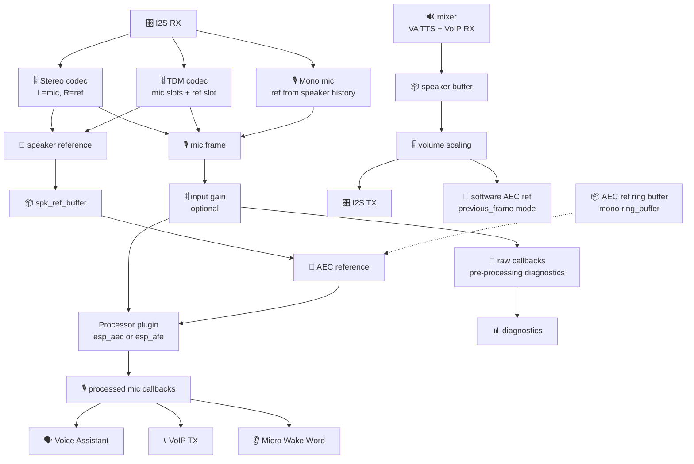

# ESP Audio Stack - Full-Duplex Audio Backend for ESPHome

`esp_audio_stack` is the shared audio backend used by the maintained full voice
and VoIP profiles in this repository. It keeps the normal ESPHome
`microphone`, `speaker`, media player, mixer, Voice Assistant and Micro Wake
Word facade, but moves low-level audio ownership to the ESP-IDF and Espressif
audio libraries: `esp_driver_i2s`, `esp_codec_dev`, `esp_audio_effects`
and, through optional processors, ESP-SR/GMF AFE.

The component is not an official Espressif product. It is a repo-native ESPHome
component that integrates Espressif libraries so board YAMLs can cover shared
codec buses, no-codec MEMS/amp builds, dual I2S buses, stereo speaker output,
hardware and software AEC references, and full AFE processors without each
profile reimplementing bus ownership.

## What It Solves

ESPHome's normal audio components are excellent when microphone and speaker are
independent devices. They are not enough for every full-duplex voice target:

- codec boards often put ADC and DAC on the same I2S bus;
- AEC needs a frame-aligned speaker reference, not an unrelated playback stream;
- VA, MWW, VoIP calls and media playback need to share the same mic/speaker safely;
- dual-mic AFE and codec feedback paths need fixed layout/rate conversion before
  ESPHome consumers see audio.

`esp_audio_stack` owns that lower layer and exposes a normal ESPHome surface
above it.

```text
Hardware / codec / I2S
        ↓
esp_audio_stack: I2S, codec IO, rate/layout conversion, speaker reference
        ↓
optional AudioProcessor: esp_aec or esp_afe
        ↓
ESPHome microphone + speaker surfaces
        ↓
Micro Wake Word, Voice Assistant, media_player, mixer, custom components
```

## Quick Map

| Use case | Recommended shape |
|---|---|
| ES8311/ES8388/ES8374/ES8389 codec board | Single-bus `esp_audio_stack.codec` with shared STD I2S bus |
| ES7210 ADC + ES8311 DAC board | TDM mic slots plus optional `use_tdm_reference` |
| INMP441 + MAX98357A on one bus | Single-bus STD I2S, `slot_bit_width: 32`, software AEC reference |
| INMP441 + MAX98357A on two buses | Dual-bus `rx_bus` + `tx_bus`, `rx_slot_mode: stereo` if the mic is strapped to a fixed stereo slot |
| Voice Assistant + MWW + VoIP | `esp_audio_stack` + `esp_aec` or `esp_afe`, then normal ESPHome consumers |
| Full AFE board | `esp_audio_stack` feeding `esp_afe`; MWW remains ESPHome/TFLite |
| Standalone audio backend, no VoIP calls | `esp_audio_stack` alone, optionally with `esp_aec` / `esp_afe` |

## Capabilities

- **True full duplex**: simultaneous RX and TX on one shared I2S bus, or on two
  separate ESP-IDF simplex controllers via `rx_bus` / `tx_bus`.
- **ESPHome facade preserved**: exposes standard `microphone` and `speaker`
  platforms, so existing ESPHome VA/MWW/media/mixer components can consume it.
- **Codec backend**: codec boards use `esp_codec_dev` directly for codec
  read/write, keeping I2S DMA completion visible to ESPHome speaker callbacks.
- **No-codec backend**: discrete MEMS microphones and I2S amplifiers use direct
  `esp_driver_i2s` read/write without codec shims.
- **Audio processors**: `processor_id` can point at `esp_aec` for lightweight
  echo cancellation or `esp_afe` for GMF/ESP-SR AFE processing.
- **Post-processor mic output**: MWW, VA and VoIP receive one stable
  processed microphone stream. If a configured processor is unavailable, output
  is silenced rather than silently falling back to raw mic audio.
- **AEC reference options**: software ring buffer, previous-frame reference,
  ES8311 stereo digital feedback, or ES7210 TDM analog feedback.
- **Multi-rate operation**: the bus can run at 48 kHz for better codec/DAC
  behavior while mic/ref/processor output runs at 16 kHz through
  `esp_ae_rate_cvt`.
- **Layout conversion**: 32-bit MEMS mic samples, stereo slot selection, TDM
  slot extraction, stereo speaker output, mono duplication and TX bit expansion
  use `esp_audio_effects` primitives.
- **Stereo speaker output**: `speaker_channels: 2` exposes a real two-channel
  ESPHome speaker and writes interleaved L/R PCM to STD stereo TX.
- **Runtime controls**: persistent master volume, post-processor mic gain,
  AEC enable switch, state hooks and optional telemetry.
- **PSRAM controls**: buffers, AEC reference ring and task stacks can be placed
  in PSRAM where it is safe; DMA-critical pieces stay internal.
- **Compile-time pruning**: dual-bus, TDM, stereo reference, ring reference,
  stereo TX, telemetry and codec paths are compiled only when YAML needs them.

## Clean Mic Surface For Wake Word, Voice Assistant And Calls

This is the main reason to use `esp_audio_stack` on full voice devices. With
the processor enabled, the public `microphone: platform: esp_audio_stack` entry
is the post-processor surface, not a second raw microphone tap. Speaker PCM from HA media, TTS,
timers, local files and call playback is also captured as the AEC/AFE
reference. `esp_aec` or `esp_afe` subtracts that reference before frames are
delivered to ESPHome consumers.

Result: the user can play music from the ESP speaker while `micro_wake_word`,
`voice_assistant` and any call component all receive the same cleaned
user-speech stream with the speaker audio removed. There is no separate
wake-word microphone to wire and no need to route Voice Assistant or Micro Wake
Word around the media player.

If no processor is configured, the facade is still a coordinated full-duplex
mic/speaker provider, but the microphone is not echo-cancelled. The parent AEC
switch is an explicit bypass: disabling it publishes converted raw mic on this
same surface. When the processor remains enabled but cannot produce valid
output, the stack emits silence instead of silently falling back to raw mic, so
speaker echo is not leaked into wake word, STT or VoIP TX during failures or
rebuilds.

The YAML stays normal ESPHome from the consumer side:

```yaml
microphone:
  - platform: esp_audio_stack
    id: clean_mic
    esp_audio_stack_id: audio_stack

micro_wake_word:
  microphone: clean_mic

voice_assistant:
  microphone: clean_mic
```

## Important Knobs

Most boards should start from a maintained YAML and only change pins, codec type
and gain. These are the knobs users most often need when building a new target:

| Knob | Why it matters |
|---|---|
| `sample_rate` / `output_sample_rate` | Run codec/speaker at the bus rate while feeding mic/AEC/VA at the processor rate. |
| `codec.input` / `codec.output` | Select `es7210`, `es8311`, `es8388`, `es8374` or `es8389` through `esp_codec_dev`. |
| `rx_bus` / `tx_bus` | Use separate I2S controllers for discrete mic and amplifier. |
| `bits_per_sample` / `slot_bit_width` | Required for 24/32-bit codecs and 32-bit MEMS microphones. |
| `mic_channel` / `rx_slot_mode` | Select the actual MEMS mic slot. `rx_slot_mode: stereo` reads both STD slots and then selects `mic_channel` in software. |
| `num_channels` / `speaker_channels` / `tx_channel` | Separate physical TX bus layout from public mono/stereo speaker behavior. |
| `processor_id` | Attach `esp_aec` or `esp_afe`. Omit it for raw full-duplex audio. |
| `aec_reference` / `aec_reference_buffer_ms` | Tune software AEC reference storage for no-codec boards. |
| `use_stereo_aec_reference` / `reference_channel` | Use ES8311 digital DAC feedback as a sample-aligned reference. |
| `use_tdm_reference` / `tdm_*` | Use ES7210 TDM mic/ref/tx slots. |
| `input_gain` | Board-level pre-processor gain staging. |
| `mic_gain` number | User-facing post-processor mic trim, `-20..30 dB`. |
| `master_volume_min_db` | Tune perceived loudness curve while keeping 0% as hard mute. |
| `buffers_in_psram` / `aec_ref_ring_in_psram` / `audio_task_stack_in_psram` | Save internal RAM on large full profiles. |
| `audio_effects.*` | Expose official `esp_ae_rate_cvt` complexity/performance policy. |

## Topology Notes

### Shared Codec Bus

Use one I2S bus when the codec owns ADC and DAC on the same pins. The stack
creates official IDF TX/RX channels and opens codec-dev data devices on top.

### Dual I2S Bus

Use `rx_bus` and `tx_bus` when the mic and amp have independent clocks. The ESP
should normally stay I2S primary on both buses. On INMP441-style modules, strap
`L/R` to the wanted slot and set:

```yaml
esp_audio_stack:
  mic_channel: right   # or left
  rx_slot_mode: stereo # read both STD slots, then pick mic_channel
```

This is intentionally different from `use_stereo_aec_reference`: stereo slot
mode is only for mic slot selection; the AEC reference still comes from the
speaker software reference path.

### Processor Choice

Use `esp_aec` for the light path: one mic plus one reference, lower memory and
clear modes. Use `esp_afe` when you need the full ESP-SR AFE pipeline:
dual-mic Speech Enhancement/BSS, NS, VAD or AGC. Wake word handling remains
ESPHome Micro Wake Word.

## Architecture



### Task Layout

| Task | Core | Priority | Role |
|------|------|----------|------|
| `audio_stack` (audio_task) | **Core 0** | **19** | I2S read/write + rate conversion + audio processor (esp_aec/esp_afe) |
| `mixer` (ESPHome) | Any | 10 | Mix Voice Assistant, media and call audio to speaker |
| `MWW inference` (ESPHome) | Unpinned | target-dependent | Wake word TFLite inference |
| ESPHome main loop / LVGL | Core 1 | 1 | Switches, sensors, display, etc. |
| WiFi driver (ESP-IDF) | Core 0 | 23 | System; can briefly preempt audio_task |

**Core allocation rationale:**
- **Core 0**: Real-time audio (I2S + AEC). WiFi (prio 23) briefly preempts for sub-ms bursts.
- **Core 1**: ESPHome main loop and other application tasks.

**CPU budget:** processor cost varies materially with ESP-SR version, selected
engine, frame shape, target clock, PSRAM placement and the rest of the
firmware. Use telemetry for a bounded diagnostic run on the final image and
record per-frame worst case and deadline misses; do not reuse percentage
figures measured on another board as a scheduler budget.

## Requirements

- **ESP32-S3** or **ESP32-P4** with PSRAM. These are the maintained and
  release-tested targets for `esp_audio_stack`, `esp_aec` and `esp_afe`.
- PSRAM is required by schema. Declare the ESPHome `psram:` component explicitly.
- TDM requires `SOC_I2S_SUPPORTS_TDM`; in the supported target set that means
  S3 and P4.
- Audio codec with shared I2S bus (ES8311 recommended), or discrete I2S mic + amp on the same bus
- ESP-IDF framework; Arduino is not supported.

## Installation

```yaml
external_components:
  - source:
      type: git
      url: https://github.com/n-IA-hane/esphome-audio-stack
      ref: main
    components: [esp_audio_stack]
```

List only the concrete audio components you use:

```yaml
external_components:
  - source:
      type: git
      url: https://github.com/n-IA-hane/esphome-audio-stack
      ref: main
    components: [esp_audio_stack, esp_aec]
    # Or with the full ESP-SR AFE pipeline:
    # components: [esp_audio_stack, esp_afe]
```

### Component Boundaries

`esp_audio_stack` owns the shared I2S bus, codec/data backend, rate conversion,
AEC reference extraction, microphone output and speaker input. It loads
Espressif `esp_codec_dev` and `esp_audio_effects` internally because those are
part of the bus backend.

The component does not load or require any call, media-player or assistant
component. Those are normal ESPHome consumers of the microphone and speaker
surfaces.

`esp_aec` and `esp_afe` are optional `AudioProcessor` providers:

- `esp_aec` provides a lightweight one-mic echo canceller.
- `esp_afe` should be called by `esp_audio_stack`, because the AFE manager
  expects steady 16 kHz frames and stable mic/reference timing.

## Configuration

### Basic Setup

```yaml
esp_audio_stack:
  id: audio_stack
  i2s_lrclk_pin: GPIO45      # Word Select (WS/LRCLK)
  i2s_bclk_pin: GPIO9        # Bit Clock (BCK/BCLK)
  i2s_mclk_pin: GPIO16       # Master Clock (optional, some codecs need it)
  i2s_din_pin: GPIO10        # Data In (from codec ADC → ESP mic)
  i2s_dout_pin: GPIO8        # Data Out (from ESP → codec DAC speaker)
  sample_rate: 16000

microphone:
  - platform: esp_audio_stack
    id: mic_component
    esp_audio_stack_id: audio_stack

speaker:
  - platform: esp_audio_stack
    id: spk_component
    esp_audio_stack_id: audio_stack
```

### Dual-Bus Codec-Less Setup

Use `rx_bus` and `tx_bus` when the microphone and amplifier are wired to
different ESP32 I2S controllers, for example INMP441 plus MAX98357A on separate
BCLK/LRCLK pairs. This follows ESP-IDF simplex channel allocation: one RX
channel on the mic port and one TX channel on the speaker port. The ESP should
normally stay I2S primary on both buses so it owns both clocks.

Dual-bus support is compile-time gated. If `rx_bus` and `tx_bus` are absent, the
generated build does not define `USE_ESP_AUDIO_STACK_DUAL_BUS` and the C++
split-data-interface path is not compiled.

```yaml
esp_audio_stack:
  id: audio_stack
  rx_bus:
    i2s_num: 0
    i2s_lrclk_pin: GPIO37
    i2s_bclk_pin: GPIO36
    i2s_din_pin: GPIO35
  tx_bus:
    i2s_num: 1
    i2s_lrclk_pin: GPIO6
    i2s_bclk_pin: GPIO5
    i2s_dout_pin: GPIO7
  sample_rate: 48000
  output_sample_rate: 16000
  slot_bit_width: 32
  correct_dc_offset: true
  processor_id: aec_processor
```

First-version limits:

- `rx_bus` and `tx_bus` must be configured together and must use different
  `i2s_num` values.
- Dual-bus mode is standard I2S only. TDM reference remains a shared-bus codec
  topology.
- Put `i2s_lrclk_pin`, `i2s_bclk_pin`, `i2s_din_pin` and `i2s_dout_pin` inside
  `rx_bus` or `tx_bus`. Do not mix top-level bus pins with split-bus pins.
- For physically separated mic/speaker clocks, start no-codec AEC tests with
  `esp_aec.filter_length: 8`; this gives the adaptive filter a longer delay
  tail without adding custom DSP.

### Configuration Options

| Option | Type | Default | Description |
|--------|------|---------|-------------|
| `id` | ID | Required | Component ID |
| `i2s_lrclk_pin` | pin | Required | Word Select / LR Clock pin |
| `i2s_bclk_pin` | pin | Required | Bit Clock pin |
| `i2s_mclk_pin` | pin | -1 | Master Clock pin (if codec requires) |
| `i2s_din_pin` | pin | -1 | Data input from codec (microphone) |
| `i2s_dout_pin` | pin | -1 | Data output to codec (speaker) |
| `rx_bus` | object | - | Optional dual-bus RX configuration with `i2s_num`, `i2s_lrclk_pin`, `i2s_bclk_pin`, optional `i2s_mclk_pin`, and `i2s_din_pin`. Requires `tx_bus`. |
| `tx_bus` | object | - | Optional dual-bus TX configuration with `i2s_num`, `i2s_lrclk_pin`, `i2s_bclk_pin`, optional `i2s_mclk_pin`, and `i2s_dout_pin`. Requires `rx_bus`. |
| `sample_rate` | int | 16000 | I2S bus sample rate (8000-48000) |
| `output_sample_rate` | int | - | Mic/AEC output rate. If set, enables sample-rate conversion (must divide `sample_rate` evenly, max ratio 6) |
| `audio_effects.rate_cvt_complexity` | int | 3 | Official `esp_ae_rate_cvt` complexity knob, 1-3. Higher is better quality and more CPU. |
| `audio_effects.rate_cvt_perf_type` | string | `speed` | Official `esp_ae_rate_cvt` performance policy: `speed` maps to `ESP_AE_RATE_CVT_PERF_TYPE_SPEED`, `memory` maps to `ESP_AE_RATE_CVT_PERF_TYPE_MEMORY`. |
| `processor_id` | ID | - | Reference to audio processor component (`esp_aec` or `esp_afe`) for echo cancellation and audio processing |
| `input_gain` | float | 1.0 | Input gain before the processor (0.01-32.0). <1.0 attenuates hot mics, >1.0 amplifies weak mics. Keep this as board-level tuning; normal user-facing volume should be handled by the post-AEC/AFE `mic_gain` number. |
| `master_volume_min_db` | float | - | Optional 1% master-volume floor in dB (-96..0). Omit it to keep codec-dev's native curve on hardware codecs; set it to tune board UX. No-codec software volume defaults to ESPHome's -49 dB curve. |
| `slot_bit_width` | int | auto | I2S slot width in bits (16, 24 or 32). Set to 32 for MEMS mics without codec (INMP441, MSM261, SPH0645). |
| `correct_dc_offset` | bool | false | Enable DC offset removal. Required for MEMS mics without built-in HPF (MSM261, SPH0645). |
| `mic_channel` | string | `left` | Which STD slot carries the microphone: `left` or `right`. In mono RX mode this becomes the IDF slot mask. With `rx_slot_mode: stereo`, both STD slots are read and this selects the slot in software. |
| `rx_slot_mode` | string | `mono` | `mono` reads only `mic_channel`. `stereo` reads both STD RX slots and then selects `mic_channel`; useful for MEMS mics strapped to L/R where the wire behaves better as a full stereo frame. This is not an AEC reference mode. |
| `use_stereo_aec_reference` | bool | false | ES8311 digital feedback mode (see below) |
| `reference_channel` | string | left | Which stereo channel carries AEC reference: `left` or `right` |
| `use_tdm_reference` | bool | false | TDM hardware reference mode (ES7210, see below) |
| `tdm_total_slots` | int | 4 | Number of TDM slots (2-8) |
| `tdm_mic_slot` | int | 0 | Single TDM slot index for the voice microphone. Use `tdm_mic_slots` instead for dual-mic Speech Enhancement. |
| `tdm_mic_slots` | list of int | - | List of 1 or 2 TDM slot indices for dual-mic configurations (e.g. ES7210 capturing two MEMS mics on slots 0 and 2). Mutually exclusive with `tdm_mic_slot`. |
| `tdm_ref_slot` | int | 1 | TDM slot index for AEC reference (e.g. MIC3 capturing DAC output) |
| `tdm_tx_slot` | int | 0 | TDM slot index where speaker TX PCM is written. Useful for boards/codecs that expect playback on a non-zero TDM slot. |
| `task_priority` | int | 19 | FreeRTOS priority of the audio task (1-24). Default 19 is above lwIP (18), below WiFi (23). |
| `task_core` | int | 0 | Core affinity: 0 or 1 for pinned, -1 for unpinned. Default 0 keeps the non-network realtime I2S bridge below Wi-Fi and above lwIP on the ESP-IDF protocol core. |
| `task_stack_size` | int | 8192 | Audio task stack size in bytes (4096-32768). Increase if you see stack overflow warnings. |
| `dma_desc_num` | int | 6 | I2S DMA descriptor count (2-16). Tune only from measured latency/underrun evidence. |
| `dma_frame_num` | int | auto | Frames per DMA descriptor (64-4092). Omitted means a rate/layout-derived value near 10 ms, clamped to IDF limits. |
| `buffers_in_psram` | bool | false | Move component-owned frame buffers (RX scratch, speaker frame scratch, processor interleave, mic/ref/output buffers) to PSRAM where possible. DMA descriptors and I2S driver buffers remain internal. Saves internal heap on full builds at the cost of PSRAM traffic. |
| `audio_task_stack_in_psram` | bool | false | Place the audio task's configured stack in PSRAM through ESPHome's PSRAM task-stack helper. This recovers approximately `task_stack_size` bytes of internal allocation at the cost of slower accesses. Enable only after measuring internal pressure and per-frame worst case. Requires `psram`; keep `false` when the target already has headroom. |
| `aec_reference` | string | `ring_buffer` | Mono-mode AEC reference source for no-codec setups. `ring_buffer` is the Espressif/ADF TYPE2-style software reference: speaker TX is staged in a delay-tunable ring before being fed to the processor. `previous_frame` is a lighter custom mode that reuses the prior TX frame, with no ring buffer and no delay tuning. Ignored when `use_stereo_aec_reference` or `use_tdm_reference` is true. |
| `aec_reference_buffer_ms` | int | 80 | Capacity of the AEC reference ring buffer in milliseconds (32 to 500). Only used with `aec_reference: ring_buffer`. Larger values absorb more producer/consumer jitter at the cost of latency. |
| `aec_ref_ring_in_psram` | bool | false | Place the software AEC reference ring in PSRAM. Its size follows rate, frame shape and `aec_reference_buffer_ms`; internal is faster, while PSRAM recovers that allocation. Measure the trade-off on target. It has no effect with `previous_frame` or a stereo/TDM hardware reference because the ring path is not compiled. |

### I2S Bus Advanced Options

These options expose the underlying I2S driver controls. Defaults are tuned for the supported codecs (ES8311, ES7210); change only when matching a specific hardware quirk or non-standard codec.

| Option | Type | Default | Description |
|--------|------|---------|-------------|
| `bits_per_sample` | int | 16 | Sample bit depth on the wire (16, 24, or 32). Must match the codec's PCM format. |
| `num_channels` | int | 1 | Physical TX bus channel count on STD I2S: 1 or 2. Full-duplex codec-reference profiles often use `2` even while the public speaker stream remains mono. |
| `speaker_channels` | int | 1 | Public ESPHome speaker stream channels: `1` mono default, `2` true interleaved stereo. Requires `num_channels: 2` on STD I2S. TDM profiles always expose mono speaker input and place it in `tdm_tx_slot`. |
| `mic_channel` | string | `left` | Same as above; listed here because it maps directly to the IDF STD slot layout. |
| `tx_channel` | string | `left` | Which stereo channel the speaker writes to: `left` or `right`. |
| `i2s_mode` | string | `primary` | I2S role: `primary` (ESP drives the clocks, default) or `secondary` (codec drives the clocks). |
| `use_apll` | bool | false | Use the APLL clock source on ESP32-P4 for cleaner audio at non-multiple-of-8 kHz rates. Costs APLL availability for other peripherals. |
| `i2s_num` | int | 0 | Which I2S peripheral port to use (0-2 depending on SoC). Lets you reserve a port when other components also use I2S. |
| `mclk_multiple` | int | 256 | MCLK to LRCLK ratio (128, 256, 384, or 512). Most codecs accept 256. |
| `i2s_comm_fmt` | string | `philips` | I2S frame format: `philips` (default), `msb`, `pcm_short`, `pcm_long`. Codec datasheets specify which one. |
| `telemetry` | bool | false | Enable per-stage cycle counting and diagnostic logging. Adds a small overhead in the audio task; only enable while tuning. |
| `telemetry_log_interval_frames` | int | 128 | When `telemetry: true`, log the snapshot every N audio frames (1-8192). Defaults to 128 frames = ~4 s at 16 kHz / 32 ms frames. |

### Microphone Options

The public `microphone: platform: esp_audio_stack` entry is intentionally thin.
It exposes the post-processor stream while the processor is enabled; the parent
AEC switch can explicitly replace that same surface with converted raw mic.
There is no second parallel pre-AEC microphone for MWW, VA or VoIP:

```yaml
microphone:
  - platform: esp_audio_stack
    id: mic_main
    esp_audio_stack_id: audio_stack
```

It mirrors ESPHome's microphone layer for actions, data callbacks, mute state,
and consumer compatibility. The hardware format belongs to the shared
full-duplex bus, so put mic hardware settings on `esp_audio_stack`, not on the
`microphone` child:

| Upstream `i2s_audio.microphone` option | `esp_audio_stack` equivalent |
|----------------------------------------|-------------------------------|
| `i2s_din_pin` | `esp_audio_stack.i2s_din_pin` |
| `sample_rate` | `esp_audio_stack.sample_rate` for the bus, plus `output_sample_rate` for mic/AEC/VA consumers |
| `bits_per_sample` | `esp_audio_stack.bits_per_sample` |
| `channel` | `esp_audio_stack.mic_channel` |
| `i2s_mode` | `esp_audio_stack.i2s_mode` |
| `use_apll` | `esp_audio_stack.use_apll` |
| `mclk_multiple` | `esp_audio_stack.mclk_multiple` |
| `correct_dc_offset` | `esp_audio_stack.correct_dc_offset` |
| `pdm` | Not supported by the full-duplex single-bus path; use ESPHome's native PDM microphone on a separate input path |

Setting `sample_rate`, `bits_per_sample`, or `num_channels` on the child
microphone is rejected at configuration time because those values would not
change the shared I2S bus.

### Speaker Options

The public `speaker: platform: esp_audio_stack` entry follows the parent audio
stack format. With `esp_audio_stack.speaker_channels: 1` it accepts mono PCM.
With `esp_audio_stack.num_channels: 2` and `speaker_channels: 2` it exposes a
two-channel ESPHome speaker and
expects standard interleaved L/R 16-bit PCM at the bus sample rate:

```yaml
esp_audio_stack:
  id: audio_stack
  sample_rate: 48000
  num_channels: 2
  speaker_channels: 2

speaker:
  - platform: esp_audio_stack
    id: hw_speaker
    esp_audio_stack_id: audio_stack
```

For no-codec or codec software-reference AEC, stereo TX is downmixed to mono for
the AEC reference with Espressif `esp_ae_ch_cvt` before rate conversion. This
keeps the public speaker stereo while preserving the mono `AudioProcessor`
contract used by `esp_aec` and `esp_afe`.

### Codec Options

Codec-backed builds use `esp_codec_dev` for register control, mute, volume,
input gain and data-device ownership. ES7210 remains input-only because it is a
multi-channel ADC. The other listed codecs can be used as ADC, DAC, or both when
the board wiring and codec datasheet match the selected I2S format:

```yaml
esp_audio_stack:
  id: audio_stack
  codec:
    i2c_id: bus_a
    input:
      type: es8388
      address: 0x10
      gain_db: 24
    output:
      type: es8388
      address: 0x10
```

| Codec type | Input | Output | Notes |
|------------|-------|--------|-------|
| `es7210` | yes | no | Multi-mic ADC, supports `mic_selected`, `ref_channel` and per-channel reference gain. |
| `es8311` | yes | yes | Single ADC/DAC codec, supports `use_mclk` and `no_dac_ref`; used by Spotpear and P4/WS3 DAC output. |
| `es8388` | yes | yes | Stereo-capable codec through `esp_codec_dev`; board analog routing still decides which channels are useful. |
| `es8374` | yes | yes | Codec-dev supported ADC/DAC codec. |
| `es8389` | yes | yes | Codec-dev supported ADC/DAC codec; `use_mclk` and `no_dac_ref` are passed through. |

The schema intentionally does not expose codec-specific private register writes.
If a board needs an analog mux, PA, or PGA quirk, keep that in a board package or
a codec-dev supported option, not as a hidden generic stack behavior.

### Rate Conversion Backend

Mic/ref rate conversion, 32-bit to 16-bit conversion, channel deinterleave and TX interleave/bit expansion are handled by Espressif `esp_audio_effects` primitives. This branch intentionally does not keep a selectable in-tree conversion backend.

| Primitive | Used for |
|-----------|----------|
| `esp_ae_rate_cvt` | Bus-rate mic/reference frames to processor rate. Multi-channel RX uses one handle so mic/ref latency stays coupled. |
| `esp_ae_bit_cvt` | 32-bit I2S samples to 16-bit processor PCM on RX, and 16-bit speaker PCM to 32-bit bus slots on TX. |
| `esp_ae_deintlv_process` | Stereo/TDM RX slot split before selecting mic/reference channels. |
| `esp_ae_intlv_process` | Dual-mic processor input, TDM TX slot layout and mono-speaker duplication onto a stereo STD TX bus. True `speaker_channels: 2` STD output is already interleaved by ESPHome and is written directly. |
| `esp_ae_ch_cvt` | Stereo speaker downmix to mono when a software AEC reference is needed. |

The selected primitives are logged at boot in `dump_config()`:

```text
[C][esp_audio_stack:...]:   Rate Converter: esp_ae_rate_cvt
```

#### Example: P4 yaml using the Espressif backend

```yaml
esp_audio_stack:
  id: audio_stack
  sample_rate: 48000
  output_sample_rate: 16000
  audio_effects:
    rate_cvt_complexity: 3
    rate_cvt_perf_type: speed
  processor_id: aec_processor
  # ... other options ...
```

Codec-backed builds use `esp_codec_dev_read()` / `esp_codec_dev_write()`
directly. The stack registers the ESP-IDF I2S TX completion callback and
reports played frames to ESPHome only after DMA has consumed them. This mirrors
ESPHome's native I2S speaker model and keeps playback feedback tied to real
DMA timing rather than to an intermediate buffer.

#### Notes

- `esp_ae_rate_cvt` is a target-specific prebuilt Espressif software library, not a documented hardware resampling peripheral.
- The multichannel TDM/stereo path deinterleaves the selected slots and calls one `esp_ae_rate_cvt_deintlv_process()` handle for the selected mic/ref channels, keeping their conversion latency coupled.

### AEC with Voice Assistant + MWW

Use `sr_low_cost` as the starting AEC mode for simultaneous VA + MWW.
Communication-oriented modes add residual suppression that can alter spectral
features used by a wake-word model. Validate any other choice with repeatable
tests on the actual enclosure and playback level.

```yaml
esp_aec:
  id: aec_component
  sample_rate: 16000
  filter_length: 4        # Starting point; tune against measured echo-tail behavior
  mode: sr_low_cost       # Linear-only AEC, preserves spectral features for MWW

esp_audio_stack:
  id: audio_stack
  # ... pins ...
  processor_id: aec_component   # or esp_afe component
  buffers_in_psram: true  # Optional when the composite firmware needs internal headroom

microphone:
  - platform: esp_audio_stack
    id: mic_aec
    esp_audio_stack_id: audio_stack

micro_wake_word:
  microphone: mic_aec     # Post-AEC works with SR linear AEC

voice_assistant:
  microphone: mic_aec
```

The post-AEC surface avoids a second microphone path. Whether wake-word
barge-in meets the product target must still be measured with real TTS/music,
far-field speech and worst-case concurrent load. Do not change MWW or audio task
priorities without deadline/latency evidence.

### AEC Mode Comparison

| Mode | Engine shape | Residual suppression | Starting point |
|------|--------------|----------------------|----------------|
| `sr_low_cost` | Linear speech-recognition AEC | No | VA/MWW baseline. |
| `sr_high_perf` | Higher-cost SR/FFT variant | No | Only after heap preflight and target measurement. |
| `voip_low_cost` | Voice-communication AEC | Yes | Call-focused target without wake-word requirements. |
| `voip_high_perf` | Higher-cost communication variant | Yes | Call-focused target with measured CPU/heap headroom. |

SR modes use a recognition-oriented linear path; VOIP modes add residual
suppression. Use `sr_low_cost` when wake-word preservation matters.
High-performance modes are not categorically forbidden on ESP32-S3: the
component checks the largest contiguous DMA-capable block and rejects a switch
that lacks headroom. Keep the low-cost mode when that preflight or real-time
qualification fails.

### ES8311 Digital Feedback AEC (Recommended)

For **ES8311 codec**, enable `use_stereo_aec_reference` to use the codec's
sample-aligned DAC feedback as the AEC reference:

```yaml
esp_audio_stack:
  id: audio_stack
  # ... pins ...
  processor_id: aec_component
  use_stereo_aec_reference: true  # ES8311 digital feedback
```

**How it works:**
- The component's ES8311 codec configuration requests the supported stereo
  ADC/DAC feedback route; no user register patch is required.
- L channel = ADC microphone, R channel = DAC loopback reference when
  `no_dac_ref: false` writes the Espressif ES8311 `ADCL + DACR` setting.
  Set `reference_channel: right` for this codec loopback mode.
- Reference is **sample-accurate** (same I2S frame as mic) → best possible AEC
- The reference comes directly from the I2S RX deinterleave, sample-accurate

### TDM Hardware Reference (ES7210 + ES8311)

For boards with **ES7210** (multi-channel ADC) + **ES8311** (DAC), the ES7210 can capture the ES8311 DAC analog output on a dedicated ADC slot, giving a sample-aligned AEC reference without the ES8311 digital feedback mode.

The shipped baseline (`packages/codec/es7210_tdm.yaml`) follows the **Espressif Korvo-2** reference: MIC3 / slot 2 = AEC ref @ 30 dB. Boards that route the DAC to a different ADC slot must override the affected PGA register from their own `on_boot` lambda **after** the baseline script runs. Set `tdm_ref_slot` accordingly in YAML.

| Board | DAC routed to | YAML setting | PGA override needed |
|---|---|---|---|
| WS3 / Spotpear / Korvo-2 | MIC3 / slot 2 | `tdm_ref_slot: 2` (baseline default) | none (baseline already sets MIC3 = 30 dB) |
| Waveshare P4 Touch | MIC2 / slot 1 | `tdm_ref_slot: 1` | reset MIC2 PGA to 0 dB; MIC3 stays at baseline |

```yaml
esp_audio_stack:
  id: audio_stack
  # ... pins ...
  processor_id: aec_component
  use_tdm_reference: true
  tdm_total_slots: 4
  tdm_mic_slot: 0           # MIC1 = voice
  tdm_ref_slot: 2           # MIC3 = DAC feedback (Korvo-2 baseline)
```

**Reference health monitor**: while the speaker is actively driving samples, the audio task watches the chosen ref slot's RMS. If it stays below -60 dBFS for ~3.2 s (100 frames at 32 ms), it emits a one-shot WARN:

```text
[W][audio_stack] TDM AEC reference silent for 100 frames while speaker active (ref -72.4 dBFS); check tdm_ref_slot wiring or set use_tdm_reference: false
```

That is the canary for "you forgot the per-board PGA override" or wiring fault. Workaround: set `use_tdm_reference: false` to fall back to the software ring-buffer reference (AEC quality drops, but the call still works).

> **Note**: `use_tdm_reference` and `use_stereo_aec_reference` are mutually exclusive. TDM mode uses `I2S_SLOT_MODE_STEREO` for the I2S channel (required to get all TDM slots in DMA).

### Multi-Rate: 48kHz I2S Bus with Espressif Rate Conversion

Many audio codecs operate cleanly at **48 kHz**. Running the I2S bus at
16 kHz can force the codec PLL and filters into a less favorable operating
point, which often results in audible artifacts, worse SNR, and suboptimal
DAC/ADC performance. At 48 kHz the codec usually produces cleaner audio: lower
noise floor, better high-frequency response for TTS and media playback.

The challenge: AEC (ESP-SR), Micro Wake Word (TFLite Micro), Voice Assistant
STT, and any AFE/AEC-backed VoIP microphone branch require **16 kHz** input.
The solution is to run the I2S bus at 48 kHz and convert only the mic/ref path
to 16 kHz with Espressif's official `esp_ae_rate_cvt` from
`esp_audio_effects`. VoIP RX and native speaker/media playback can remain
at the speaker path rate.

#### Signal Flow

```text
                    ┌─── Speaker path ──────────────────────────────→ I2S TX (48kHz)
                    │    (native rate, no resampling)
I2S bus: 48kHz ─────┤
                    │    ┌─ esp_ae_rate_cvt ×3 ─┐
                    └─── Mic path (48kHz) ───┘──→ 16kHz ──→ AEC / MWW / VA / AFE VoIP TX
```

`esp_ae_rate_cvt` is the standalone C API behind Espressif's GMF `aud_rate_cvt` element. The TDM/stereo path uses one multi-channel converter handle for selected mic/ref channels, so the relative latency between microphones and reference stays coupled. Mono software-reference AEC uses the same converter for both RX mic and TX reference.

If `output_sample_rate` is omitted the conversion ratio is 1. Bit-depth and layout conversion still use `esp_audio_effects` when the bus format needs it.

| Parameter | Value |
|-----------|-------|
| Backend | Espressif `esp_audio_effects` / `esp_ae_rate_cvt` |
| Processing mode | Interleaved for mono, deinterleaved multi-channel for TDM/stereo mic/ref |
| Complexity | 3 |
| Performance mode | `ESP_AE_RATE_CVT_PERF_TYPE_SPEED` |
| Supported ratios | 2, 3, 4, 5, 6 |
| Allocation timing | Audio-effects handles and scratch buffers are prepared before the first realtime audio frame |

#### esp_audio_stack Config

```yaml
esp_audio_stack:
  id: audio_stack
  # ... pins ...
  sample_rate: 48000           # I2S bus rate (ES8311/ES7210 native, best DAC quality)
  output_sample_rate: 16000    # Mic/AEC/MWW/VA converted to 16kHz via esp_ae_rate_cvt
  processor_id: aec_component
  use_stereo_aec_reference: true    # Reference from I2S RX stereo deinterleave (no delay needed)

esp_aec:
  id: aec_component
  sample_rate: 16000           # AEC always operates on 16kHz audio
  filter_length: 4
  mode: sr_low_cost      # Linear AEC, preserves spectral features for MWW
```

#### Speaker Path: ResamplerSpeaker + Mixer

Since the I2S bus runs at 48kHz the speaker must also receive 48kHz audio. ESPHome's `resampler` speaker platform transparently converts any input rate to the target rate:

```yaml
speaker:
  # Hardware output: writes 48kHz PCM to the I2S bus
  - platform: esp_audio_stack
    id: hw_speaker
    esp_audio_stack_id: audio_stack
    buffer_duration: 500ms
    # timeout is optional and defaults to never. Set e.g. timeout: 10s only
    # when this hardware speaker should auto-stop after an abandoned writer.

  # Mixer combines VA TTS and VoIP at 48kHz
  - platform: mixer
    id: audio_mixer
    output_speaker: hw_speaker
    num_channels: 1
    source_speakers:
      - id: va_speaker_mix
        timeout: 10s
      - id: voip_speaker_mix
        timeout: 10s

  # ResamplerSpeakers: convert any input rate → 48kHz before the mixer
  - platform: resampler
    id: va_speaker               # VA TTS and media player output here
    output_speaker: va_speaker_mix

  - platform: resampler
    id: voip_speaker         # Converts lower-rate VoIP RX only when needed
    output_speaker: voip_speaker_mix
```

The `resampler` platform uses polyphase interpolation. Lowering its filter/tap
settings trades quality for CPU, but the cost depends on input/output rate,
target and concurrent workload. Profile before changing them and listen/test
the result; do not reduce quality merely to suppress a long-loop warning whose
actual blocking source has not been identified.

#### How Home Assistant Knows to Send 48kHz

HA reads the `sample_rate` from the `announcement_pipeline` in the `media_player` config and transcodes audio accordingly via `ffmpeg_proxy`:

```yaml
media_player:
  - platform: speaker_source
    announcement_pipeline:
      speaker: va_speaker        # Points to the resampler speaker
      format: FLAC
      sample_rate: 48000         # HA will transcode TTS and media to FLAC 48kHz
      num_channels: 1
```

For TTS, HA requests the TTS engine at 48kHz directly. For radio/media streams, `ffmpeg_proxy` transcodes the source to FLAC 48kHz before sending it to the device. In both cases audio arrives at the ESP at 48kHz and goes to the speaker without any intermediate downsampling.

> **Note**: Do not patch ES8311 feedback registers from YAML. Codec setup is
> owned by `esp_codec_dev`; `use_stereo_aec_reference` and `reference_channel`
> select the supported stack behavior. Without a hardware feedback mode,
> no-codec builds use `aec_reference` (`ring_buffer` by default,
> `previous_frame` for light profiles).

## Pin Mapping by Codec

### ES8311 (Spotpear Ball v2, AI Voice Kits)

```yaml
esp_audio_stack:
  i2s_lrclk_pin: GPIO45   # LRCK
  i2s_bclk_pin: GPIO9     # SCLK
  i2s_mclk_pin: GPIO16    # MCLK (required)
  i2s_din_pin: GPIO10     # SDOUT (codec → ESP)
  i2s_dout_pin: GPIO8     # SDIN (ESP → codec)
  sample_rate: 48000             # ES8311 native rate (better DAC quality)
  output_sample_rate: 16000      # Mic/AEC/MWW/VA at 16kHz (rate conversion x3)
  use_stereo_aec_reference: true # Digital feedback (recommended)
```

### ES8311 + ES7210 TDM (Waveshare ESP32-S3-AUDIO-Board, Korvo-2 wiring)

```yaml
esp_audio_stack:
  i2s_lrclk_pin: GPIO14   # LRCK (shared bus)
  i2s_bclk_pin: GPIO13    # SCLK
  i2s_mclk_pin: GPIO12    # MCLK (required)
  i2s_din_pin: GPIO15     # ES7210 SDOUT (codec -> ESP)
  i2s_dout_pin: GPIO16    # ES8311 SDIN (ESP -> codec)
  sample_rate: 16000
  use_tdm_reference: true
  tdm_total_slots: 4
  tdm_mic_slot: 0          # MIC1 = voice
  tdm_ref_slot: 2          # MIC3 = DAC analog feedback (Korvo-2 baseline)
  # Waveshare P4 Touch: tdm_ref_slot: 1 (MIC2) + override MIC2 PGA to 0 dB in on_boot
```

### ES8388 (LyraT, Audio Dev Boards)

```yaml
esp_audio_stack:
  i2s_lrclk_pin: GPIO25   # LRCK
  i2s_bclk_pin: GPIO5     # SCLK
  i2s_mclk_pin: GPIO0     # MCLK (required)
  i2s_din_pin: GPIO35     # DOUT
  i2s_dout_pin: GPIO26    # DIN
  sample_rate: 16000
```

## When to Use This vs Standard i2s_audio

| Scenario | Use This Component | Use Standard i2s_audio |
|----------|-------------------|----------------------|
| ES8311/ES8388/ES8374/ES8389 codec | Yes | No for shared-bus full duplex |
| INMP441 + MAX98357A on same bus | Yes (direct TX reference, `slot_bit_width: 32`) | No |
| INMP441 + MAX98357A on separate buses | Either works | Yes |
| PDM microphone + I2S speaker | No | Yes (different protocols) |
| Need true full-duplex on single bus | Yes | Limited |
| VA + MWW + VoIP on same device | Yes (single bus) | Yes (dual bus with mixer speaker) |

## Technical Notes

- **Sample Format**: 16-bit signed PCM, mono TX / stereo RX (ES8311 feedback mode)
- **DMA Buffers**: owned by Espressif's official `esp_driver_i2s` channel layer.
  YAML exposes `dma_desc_num` (default 6) and optional `dma_frame_num`. When
  `dma_frame_num` is omitted, the component derives roughly 10 ms descriptors
  and clamps them to IDF limits. Change either value only from measured
  underrun/latency evidence, then retest every active bus topology.
- **Speaker Buffer**: the public `speaker: platform: esp_audio_stack` exposes ESPHome-compatible `buffer_duration` and `timeout` options. Default `buffer_duration: 500ms` allocates a mono PCM staging ring at the I2S bus rate, preferably in PSRAM. `timeout` defaults to `never`; set an explicit value such as `10s` only when the hardware speaker should auto-stop after an abandoned writer.
- **Task Priority**: 19 (above lwIP at 18, below WiFi at 23). Configurable via `task_priority` YAML option.
- **Core Affinity**: Pinned to Core 0 by default for the non-network realtime
  I2S bridge. The dual-mic GMF AFE path normally keeps manager feed on Core 0
  and manager fetch/pipeline work on Core 1. Other consumers may still run on
  either core. `task_core` is configurable, but change it only from measured
  contention/deadline evidence.
- **Processor Surface**: Mono, stereo and TDM processor modes all keep callbacks on the processed surface. Mono software-reference mode zero-fills the reference when playback is idle instead of switching around the processor.
- **Thread Safety**: Cross-thread scalars use atomics with ordering selected for
  their role: relaxed snapshots for independent controls/counters, and stronger
  acquire/release ordering for lifecycle or ownership publication where
  required. Speaker/media volume, input attenuation and mic attenuation are
  converted to Q31 values when they change; the audio task snapshots them once
  per frame. Ring-buffer resets use request flags so the owning audio task
  performs the mutation.
- **Task Structure**: `audio_task_()` is split into `process_rx_path_()`, `process_aec_and_callbacks_()`, and `process_tx_path_()`, sharing state via `AudioTaskCtx` struct. AEC buffers use 16-byte aligned allocation for ESP-SR SIMD safety.
- **I2S hardware lifecycle**: the component creates and initializes official
  IDF `esp_driver_i2s` TX/RX channels on demand. `esp_codec_dev_open()` then
  enables the underlying data interfaces. Runtime `stop()` parks the audio
  task, closes `esp_codec_dev`, then deletes the IDF channels. Mic-only
  configurations still create a clock-only TX channel with `dout = GPIO_NUM_NC`,
  matching Espressif's TX-clock-for-RX full-duplex pattern.
- **Runtime state hooks**: the parent component exposes a minimal runtime state
  machine for YAML automation. `on_state` receives `idle`, `mic`, `speaker` or
  `duplex`. `on_mic_start`/`on_mic_idle` fire on microphone consumer edges.
  `on_speaker_start`/`on_speaker_idle` fire on speaker playback edges and are
  the right hooks for amplifier power gating; do not use the generic audio-stack
  `on_start`/`on_idle` for speaker power if wake word or VA can keep the mic
  path active.
- **Mic Gain**: -20 to +30 dB range (applied post-AEC in audio_task). Stored via `ESPPreferenceObject` and restored on boot. Mic gain is applied to post-AEC output (affects VA/VoIP/MWW equally). Values at or below 0 dB use ESPHome's Q31 `esp-audio-libs` gain path, including zero as a `memset()` fast path. Positive gain uses Espressif `esp_ae_alc` with the YAML number's 1 dB step. **Clipping warning**: positive gain can still saturate the PCM stream. On loud speech with gain > +6 dB, peak samples can clip and produce harmonic distortion that degrades STT and VoIP audio. If you need gain > +6 dB to bring a weak MEMS mic up to working levels, pair this component with `esp_afe` and `agc_enabled: true`; with standalone `esp_aec` there is no automatic ceiling.
### Audio task lifecycle

The audio task is an internal FreeRTOS task with three properties worth knowing about in the current design:

- **Permanent early creation**. The task is created during component setup and then parks in its outer wait loop until `esp_audio_stack.start` flips `audio_stack_running_`. This reserves the TCB/stack before Wi-Fi/API/VA churn fragments internal RAM.
- **No task churn; intentional I2S churn**. Once created, the audio task lives
  for the rest of the device's uptime. I2S channels do not:
  `esp_audio_stack.stop` deletes the IDF TX/RX channel handles after the task
  parks, so the bus is really stopped. A subsequent `start` reuses the same
  TCB/stack and creates fresh `esp_driver_i2s` channels.
- **In-place reconfigure**. When the linked processor's `frame_spec` changes
  (for example after an AFE mode or graph rebuild), the audio task observes the
  `frame_spec_revision()` bump at the top of its main loop and reinitialises
  rate conversion, reference extraction and output buffers in place.
  Worst-case-sized buffers are preallocated by the parked audio task once the
  processor frame shape is known, before the first media/call activation. The
  reconfigure path does not call `heap_caps_alloc` and cannot fragment SPIRAM.

This is why mic consumers (MWW, Voice Assistant, VoIP) survive an internal stop/start cycle: the task and its consumer registry are intact across reconfigure.

### Mic consumer registry (C++ API)

Components that want to receive processed mic frames register themselves once at setup with an opaque token:

```cpp
esp_audio_stack_->register_mic_consumer(this);   // typically `this` of the consumer component
// ... runs forever ...
esp_audio_stack_->unregister_mic_consumer(this); // optional, only if the consumer is destroyed
```

The token is just an identity; the registry tracks live consumers in a fixed-size
array and gates the mic capture (no consumers means no callbacks fired). The
registry survives `stop()` and internal reconfigure cycles, so consumers do not
need to re-register. Replaces the older `mic_ref_count_` atomic refcount, which
lost its count on `stop()` and silently disconnected MWW / VA after every
internal reconfigure.

### Mono-mode AEC reference

When neither `use_stereo_aec_reference` nor `use_tdm_reference` is enabled, the AEC reference comes from the speaker output. Two options via `aec_reference:`:

- **`ring_buffer`** (default): speaker TX is stored in an Espressif/ADF TYPE2-style ring buffer with `aec_reference_buffer_ms` of capacity. The mono-reference helper reads from the ring; on starvation it zero-fills (the AEC handles that as a "no echo this frame") rather than reusing stale data. Better frame alignment on no-codec setups (discrete MEMS mic + I²S amp) at the cost of `aec_reference_buffer_ms` of latency.
- **`previous_frame`**: the audio task uses the prior TX frame as the AEC reference. Simple, lower RAM and smaller compile-time surface; no TYPE2 ring buffer or delay tuning is compiled into that build.

### PSRAM and sdkconfig Requirements

These settings are starting profiles used by maintained boards, not universal
requirements. Cache size, XIP support, display load and TLS placement differ by
target and ESP-IDF release. Begin with the closest maintained board package,
change one setting at a time, and compare boot headroom plus real-time worst
case before retaining it.

**ESP32-S3:**

```yaml
sdkconfig_options:
  CONFIG_ESP32S3_DATA_CACHE_64KB: "y"
  CONFIG_ESP32S3_DATA_CACHE_LINE_64B: "y"
  CONFIG_SPIRAM_FETCH_INSTRUCTIONS: "y"
  CONFIG_SPIRAM_RODATA: "y"
  CONFIG_MBEDTLS_EXTERNAL_MEM_ALLOC: "y"
```

**ESP32-P4:**

```yaml
sdkconfig_options:
  CONFIG_CACHE_L2_CACHE_256KB: "y"          # Default is 128KB; 256KB for MIPI DSI+audio+LVGL
  CONFIG_SPIRAM_FETCH_INSTRUCTIONS: "y"
  CONFIG_SPIRAM_RODATA: "y"
  CONFIG_MBEDTLS_EXTERNAL_MEM_ALLOC: "y"
```

Do not increase the task watchdog timeout to hide display, networking or audio
stalls. A loop/task warning is evidence to profile the blocking component and
its worst-case interaction; extending the watchdog does not restore scheduling
headroom.

## Logging

The driver and its helper entities log under namespaced tags so callers can mute pieces independently.

| Tag | Source | Function |
|---|---|---|
| `audio_stack` | `esp_audio_stack.cpp`, `audio_pipeline.cpp` | Driver init/teardown, channel start/stop, mic consumer registry, AEC reference selection, throttled I2S read/write WARNs |
| `audio_stack.mic_gain` | `number.h` | `dump_config` for the mic gain helper number |
| `audio_stack.master_volume` | `number.h` | `dump_config` for the Master Volume helper number |
| `audio_stack.tdm_slot_sensor` | `sensor.h` | `dump_config` for the TDM slot level sensor |
| `audio_stack.aec_switch` | `switch.h` | `dump_config` for the AEC enable switch |

**Default levels**

- `WARN` - codec/I2S read/write failures (rate-limited 1st-5th + every 100th via `LOG_W_THROTTLED`), `TX/RX channel re-enable failed`, audio task did not park within 600 ms
- `INFO` - driver lifecycle (`ESP audio stack initialized`, `Audio stack started/stopped`, `Mic consumer registered/removed`, `Audio stack going idle`), AEC reference mode chosen
- `DEBUG` - channel creation details (TDM mask, rate-conversion ratio), per-frame audio session start/end, TDM slot configuration

**Telemetry overhead**

When `telemetry: true` AND the global `level: DEBUG`, `audio_pipeline.cpp` logs a per-frame snapshot every `telemetry_log_interval_frames` frames (default 128 ≈ 4 s @ 16 kHz / 32 ms). The block is **fully stripped at compile time** when either flag is missing - `#if defined(USE_ESP_AUDIO_STACK_TELEMETRY) && ESPHOME_LOG_LEVEL >= ESPHOME_LOG_LEVEL_DEBUG`. Production YAMLs ship with `telemetry: false`, so no telemetry compute or log strings reach the binary regardless of log level.

**Quiet AEC tuning**

When chasing AEC issues you usually only want `audio_stack` itself, not the helper entities:

```yaml
logger:
  level: DEBUG
  logs:
    audio_stack.mic_gain: INFO
    audio_stack.master_volume: INFO
    audio_stack.aec_switch: INFO
    audio_stack.tdm_slot_sensor: INFO
```

## Troubleshooting

### No Audio Output
1. Check MCLK connection (many codecs require it)
2. Verify codec I2C initialization (check logs)
3. Ensure speaker amp is enabled (GPIO control if applicable)

### Audio Crackling
1. Compare I2S read/write error and underrun counters with the negotiated bus
   format and configured DMA geometry.
2. Correlate glitches with Wi-Fi, display and API load using bounded telemetry;
   do not repin the audio task blindly. The maintained default is Core 0.
3. Verify PSRAM is declared/available and inspect minimum free plus largest
   contiguous internal block.
4. Reduce sample rate only as an explicit product trade-off and revalidate every
   consumer/codec contract.

### Echo During Calls
1. Enable AEC: set `processor_id` on `esp_audio_stack`
2. For ES8311, enable `use_stereo_aec_reference: true`, keep the codec's
   `no_dac_ref` settings consistent and select the documented reference channel;
   no manual register patch is required.
3. Adjust `filter_length` only from captured echo-tail measurements.

### TDM Mode: Audio Corruption (Whistle/Machine Gun Noise)
1. Ensure I2S uses `I2S_SLOT_MODE_STEREO` (not MONO) for TDM. MONO only puts slot 0 in DMA
2. Check ES7210 TDM register initialization (reg 0x12 = 0x02 for TDM mode)
3. Verify `tdm_total_slots` matches the actual ES7210 slot count
4. If the slot mapping is correct but corruption persists, inspect the computed
   `esp_driver_i2s` `dma_frame_num` in logs and compare it with the active
   sample rate, slot width and `tdm_total_slots`.

### MWW Not Detecting During TTS
1. **Use `sr_low_cost` AEC mode** (not VOIP). See [AEC Mode Comparison](#aec-mode-comparison).
2. **MWW on `mic_aec`** (post-AEC), not on an unprocessed microphone path.
3. If internal RAM pressure is measured, test `buffers_in_psram: true` and
   compare per-frame worst case.
4. Use a high-performance mode only when its contiguous-DMA preflight succeeds
   and the complete workload still meets deadlines.

### Switches/Display Slow With AEC On
The maintained default keeps `audio_stack` on Core 0, but Wi-Fi can preempt it
and GMF/display/application work may occupy either core. Capture task timing and
loop warnings under the failing composite workload before changing affinity or
priority; a core move can simply transfer the contention.

### SPI Errors (err 101) With AEC
1. Start from a low-cost mode. If a high-performance mode is rejected, inspect
   the logged largest contiguous DMA-capable block.
2. Enable `buffers_in_psram: true` to free internal heap
3. Reduce display update interval (500ms+) to avoid SPI bus contention
4. Check free heap in logs after boot

## Known Limitations

- **Media files should match bus sample rate**: For best quality, use media files at the bus `sample_rate` (e.g. 48kHz). The `resampler` speaker handles conversion from any rate, but native rate avoids resampling artifacts.
- **loopTask long-operation warnings during streaming**: Do not classify these
  as expected or harmless. Dedicated I2S processing may continue, but a stalled
  ESPHome loop can delay API, UI, automations, buffers and lifecycle control.
  Compare against the same firmware with audio idle, identify the component
  consuming the interval, and reject changes that turn a normal loop cadence
  into repeated long stalls.
- **AEC is ESP-SR closed-source**: Cannot reset the adaptive filter without recreating the handle. When a processor is configured, this component no longer switches to raw mic audio during idle or reinit windows; unavailable processed output is silenced.
- **Processor bypass control**: the parent `esp_audio_stack` AEC switch toggles
  `processor_enabled`. Disabled means the single public microphone surface
  explicitly carries the converted raw mic; enabled but temporarily unavailable
  fails closed to silence instead of leaking raw audio during processor
  init/rebuild/failure. Per-feature AFE switches have their own semantics.
- **TDM analog reference vs ES8311 digital feedback**: Digital codec feedback
  is normally more sample-aligned and excludes some analog-path distortion.
  TDM analog feedback includes the DAC/amplifier/capture chain and can better
  represent some physical effects while also adding nonlinearities. Neither
  topology has a universal cancellation percentage; qualify it with captured
  near/far speech on the final enclosure.
- **AEC reference**: The reference signal is always the exact post-volume PCM sent to the speaker, with no additional scaling. For hardware codec setups (ES8311, TDM), the reference naturally includes hardware volume. For software reference (no codec), the reference includes software volume. Pre-AEC input gain/gain affects only the mic signal, not the reference; use it sparingly because it changes what the AEC/AFE sees.

## License

The ESPHome wrapper code is MIT-licensed. Espressif libraries fetched for
codec, conversion and optional processing retain their own licenses and
product-use restrictions; see the repository `THIRD_PARTY_NOTICES.md`.
